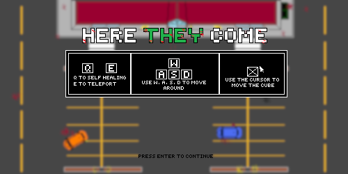

<!DOCTYPE html>
<html>
<body>
  <header>
    <h1>Here They Come</h1>
  </header>

  <main>
    <section>
      <h2>This game was created for the OOP subject in our university. "Here They Come" is an exhilarating survival game set in a zombie-infested shopping mall parking lot. In the midst of a zombie apocalypse, you take on the role of a courageous survivor, fighting for your life amidst the chaos.

In this game, you'll face hordes of flesh-eating zombies as you explore the mall parking lot. Use your combat skills and strategy to survive for as long as possible. The score increases, allowing you to set the top score in the game for all players to challenge.

The mall parking lot environment offers diverse gameplay, with obstacles to hinder your progress and mobile cover to defend yourself.

Get ready for an intense and adrenaline-filled experience where every decision counts. Time is running out, the zombies are closing in, and your only hope is to stay alive until help arrives. Do you have what it takes to survive this zombie nightmare?</h2>
      

    </section>

    <section>
      <h2>Do you want to play?
      Do a git clone of project, use your IDE of your preference and write "./gradlew run" 
      Have fun :)

    </section>

    <section>
      <h2>Imagens</h2>
      
    </section>
  </main>

  <footer>
    
&copy; 2023 Augusto Fernandes Macri, João Pedro Cruz Espíndola e Gabriel Antônio de Oliveira Leite

  </footer>
</body>
</html>
